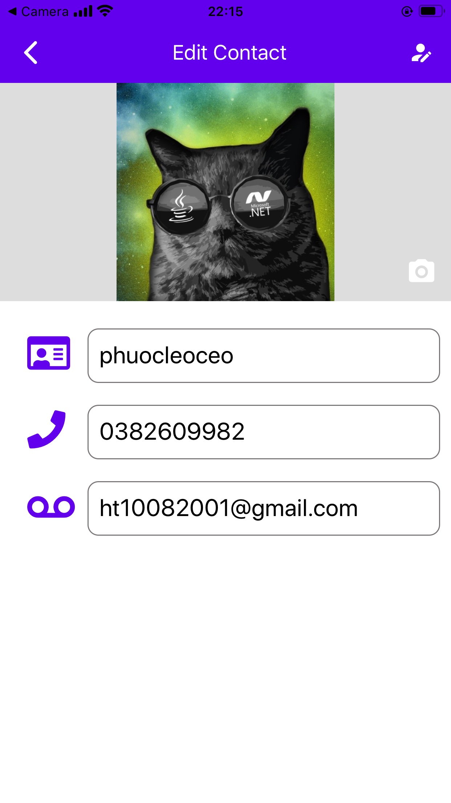

<br />

<p align="center">
  <p align="center">
    
  </p>

  <h3 align="center">CONTACT APP</h3>
</p>

## About The Project

Project is an React Native Project for University Exercise.

## Installed Package

1. npm
```
--save recyclerlistview --save react-native-vector-icons react-native-paper @react-navigation/native @react-navigation/native-stack react-hook-form react-redux @reduxjs/toolkit
```

2. expo
```
expo-image-picker expo-sqlite expo-sqlite-orm
```

## Usage

**1. Home**
    <br/>
    <br/>
    

**2. Add**
    <br/>
    <br/>
    

**3. Detail**
    <br/>
    <br/>
    

**4. Edit**
    <br/>
    <br/>
    

**5. Search**
    <br/>
    <br/>
    

**6. Call**
    <br/>
    <br/>
    
